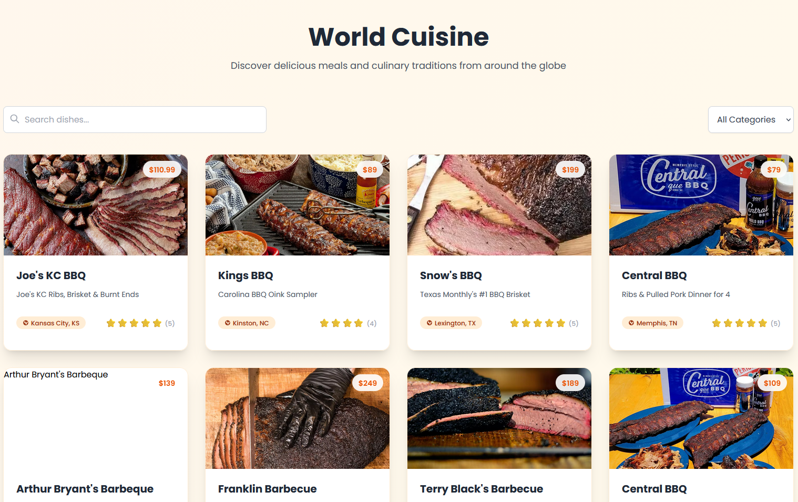

# MEALIFY - REACT FOOD CATALOGUE PROJECT

In this project, I developed a frontend web application, a comprehensive culinary catalogue using Free Food Menus API and displayed the data through my React Application built with Vite.

## Features

- **Listing of International Dishes** from various cuisines worldwide
- **Category-based Filtering** (Burgers, Pizzas, Desserts, Drinks, etc.)
- **Search Functionality** for specific food items
- **Detailed Food Information** including pricing, ratings, and descriptions
- **Country of Origin** display for each dish
- **Responsive Grid Layout** optimized for all devices
- **Pagination System** for efficient navigation through large collections

## Live Demo

[Live Demo Link]()

## Screenshots



## Built With

- React
- Vite
- Tailwind CSS
- JavaScript (ES6+)
- Food API Integration

## Getting Started

### Prerequisites

Make sure Node.js (version 14 or higher) is running on your local machine

### Installation

1. Clone the repository
```bash
git clone https://github.com/your-username/mealify.git
cd mealify
```
2. Install dependencies
```bash
npm install

```
3. Start the development server
```bash
npm run dev
```
4. Open http://localhost:5173 to view it in the browser

Give a ⭐️ if you like this project!

### Acknowledgments

    Free Food Menus API

    React Community

    Vite Build Tool

    Tailwind CSS